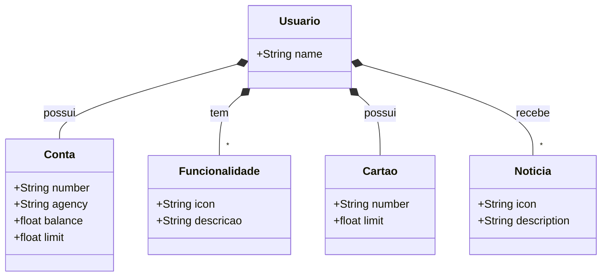

# dio1
Referente ao projeto 1 do bootcamp 2025

```mermaid
classDiagram
    class Usuario {
        +String name
    }
    
    class Conta {
        +String number
        +String agency
        +float balance
        +float limit
    }
    
    class Funcionalidade {
        +String icon
        +String descricao
    }
    
    class Cartao {
        +String number
        +float limit
    }
    
    class Noticia {
        +String icon
        +String description
    }
    
    Usuario *-- Conta : possui
    Usuario *-- "*" Funcionalidade : tem
    Usuario *-- Cartao : possui
    Usuario *-- "*" Noticia : recebe
```
